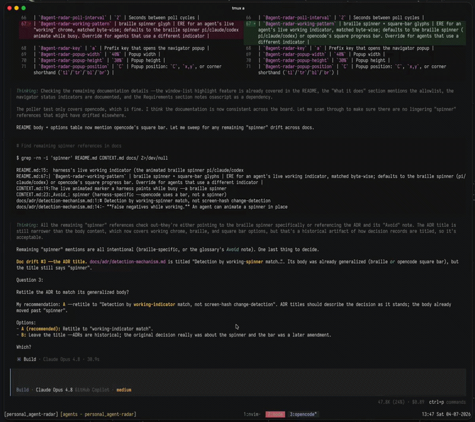

<p align="center"></p>

# agent-radar

A self-contained tmux plugin that gives you the one [herdr](https://github.com/ogulcancelik/herdr) feature worth having
without leaving tmux: see every running coding agent, jump straight to the pane
it lives in, and get told the moment any agent stops needing you, for *any*
harness, not just the ones with hooks.

## What it does

- **Detects agent panes**: any tmux pane whose foreground process matches the
  allowlist (`pi,claude,codex,opencode,aider,cursor` by default).
- **Notices when an agent stops**: polls each agent pane and looks for the
  harness's live working indicator. A pane is `working` while that indicator
  is on screen and flips to `stopped` when it's gone for N seconds.
- **Notifies you**: an OS notification fires once per stop transition (via
  `osascript` on macOS, `notify-send` on Linux), backed by a persistent status-left
  segment listing sessions with a stopped agent and a highlighted tmux window
  until you focus the exact agent pane.
- **Navigates**: `prefix + a` opens an fzf popup listing all agent panes,
  stopped ones first, with a red/yellow/green status dot (unseen-stopped,
  running, seen-stopped) and stopped age. The list refreshes while open. Pick
  one and it jumps to that exact `session:window.pane`.

## Requirements

- `tmux`
- `fzf` (for the navigator popup)
- OS notifications use `osascript` on macOS and `notify-send` on Linux; if
  neither is present, the status segment still works. Everything else is
  cross-platform.

## Install

Clone the repo:

```sh
git clone https://github.com/vieitesss/agent-radar.git ~/.tmux/plugins/agent-radar
```

Then add to `~/.tmux.conf`:

```tmux
run-shell ~/.tmux/plugins/agent-radar/agent-radar.tmux
```

## Usage

- `prefix + a`: open the navigator popup, select an agent, jump to its pane.
- The status-left segment shows sessions with an unseen stopped agent, e.g.
  `[agents - work / build×2]`; those tmux windows are highlighted until you
  focus the exact agent pane.

## Options

Set with `tmux set-option -g <name> <value>` (or `set -g` in `~/.tmux.conf`):

| Option | Default | Meaning |
|--------|---------|---------|
| `@agent-radar-processes` | `pi,claude,codex,opencode,aider,cursor` | Comma-separated agent executable names to detect |
| `@agent-radar-idle-seconds` | `3` | Seconds with no working indicator before a pane is "stopped" (the one calibration knob) |
| `@agent-radar-poll-interval` | `2` | Seconds between poll cycles |
| `@agent-radar-working-pattern` | braille + square-bar glyphs | ERE for an agent's live working indicator, matched byte-wise; defaults to the braille glyph (pi/claude/codex) or opencode's square progress bar. Override for agents that use a different indicator |
| `@agent-radar-key` | `a` | Prefix key that opens the navigator popup |
| `@agent-radar-popup-width` | `40%` | Popup width |
| `@agent-radar-popup-height` | `30%` | Popup height |
| `@agent-radar-popup-position` | `C` | Popup position: `C`, `x,y`, or corner shorthand (`tl`/`tr`/`bl`/`br`) |
| `@agent-radar-status-label` | `agents` | Label in the status segment |
| `@agent-radar-status-color` | `yellow` | Color of the status segment |
| `@agent-radar-window-color` | `red` | Background color for windows containing unseen stopped agents |
