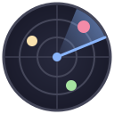
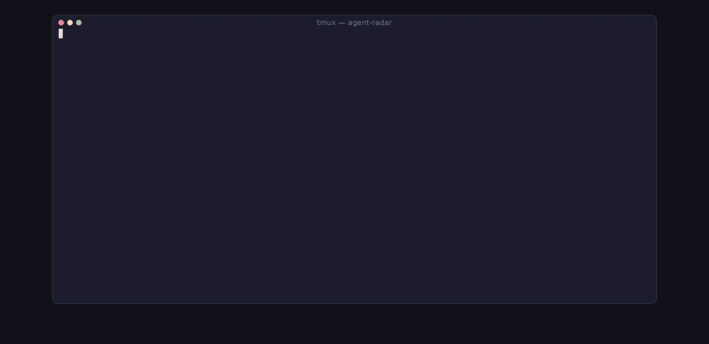
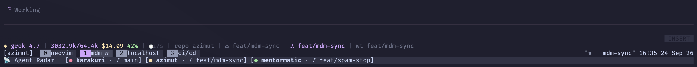
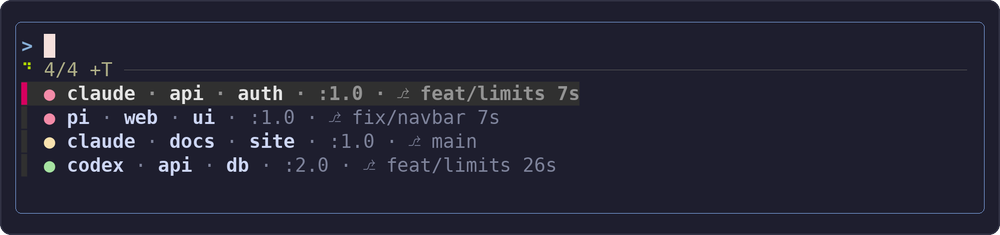

<p align="center">
  
</p>

<h1 align="center">agent-radar</h1>

<p align="center">
  <strong>See every coding agent in tmux, know when it stops, jump right to it.</strong>
</p>

<p align="center">
  <a href="https://github.com/vieitesss/agent-radar/releases/latest"></a>
  <a href="https://github.com/vieitesss/agent-radar/actions/workflows/test.yaml"></a>
  <a href="LICENSE"></a>
</p>

<p align="center">
  <a href="#features">Features</a> ·
  <a href="#install">Install</a> ·
  <a href="#usage">Usage</a> ·
  <a href="#supported-harnesses">Harnesses</a> ·
  <a href="#options">Options</a> ·
  <a href="CONTRIBUTING.md">Contributing</a>
</p>

<p align="center">
  
</p>

A self-contained tmux plugin that brings the one [herdr](https://github.com/ogulcancelik/herdr)
feature worth having to plain tmux. It works with any agent harness, including
the ones that have no hooks.

## Features

<table>
  <tr>
    <td width="33%" valign="top">
      <h4>📡 Glance row</h4>
      An extra status row lists every agent pane with a status dot. It sits below
      your own status line and doesn't replace it.
    </td>
    <td width="33%" valign="top">
      <h4>🧭 Navigator</h4>
      <code>prefix + a</code> lists every agent pane, the ones waiting for you first. Pick one
      to jump to its exact <code>session:window.pane</code>.
    </td>
    <td width="33%" valign="top">
      <h4>🔔 Notifications</h4>
      You get one OS notification each time an agent stops. A short sound is
      optional.
    </td>
  </tr>
  <tr>
    <td valign="top">
      <h4>🟥 Window highlight</h4>
      A window with a stopped agent you haven't looked at stays highlighted until
      you focus that agent's pane.
    </td>
    <td valign="top">
      <h4>🧩 Any harness</h4>
      No hooks needed. agent-radar reads each harness's working indicator from
      the screen.
    </td>
    <td valign="top">
      <h4>🎛️ Configurable</h4>
      You choose the fields, the row, the colors, the keys and the timings, all
      with tmux options.
    </td>
  </tr>
</table>

### How it works

agent-radar finds **agent panes**: panes whose foreground process is on an
allowlist of harnesses. It polls each one for the harness's **working
indicator**, such as the animated braille glyph or Claude Code's in-flight
status line. A pane is **working** while that indicator is on screen. It becomes
**stopped** once the indicator has been gone for a few seconds, which means the
agent needs you.

| Dot | State | Meaning |
|:---:|-------|---------|
| 🔴 | Unseen-stopped | Stopped, and you haven't focused its pane since. These are the agents waiting for you. |
| 🟡 | Working | The working indicator is on screen. |
| 🟢 | Seen-stopped | Stopped, and you've looked at it since. |

## Install

Requirements: `tmux` and `fzf` (for the navigator). For OS notifications you
also need `osascript` on macOS or `notify-send` on Linux. Without them the
glance row and window highlighting still work.

Set any options **before** loading the plugin. Don't load it twice.

<details open>
<summary><strong>With TPM</strong></summary>

```tmux
set -g status on
set -g @agent-radar-glance-fields 'dot,session,branch'
set -g @plugin 'vieitesss/agent-radar'

run '~/.tmux/plugins/tpm/tpm'
```

Press `prefix + I` to install.

</details>

<details>
<summary><strong>Manually</strong></summary>

```sh
git clone https://github.com/vieitesss/agent-radar.git ~/.tmux/plugins/agent-radar
```

```tmux
set -g status on
set -g @agent-radar-glance-fields 'dot,session,branch'
run-shell ~/.tmux/plugins/agent-radar/agent-radar.tmux
```

Reload with `tmux source-file ~/.tmux.conf`.

</details>

With `status on`, tmux shows one status row. While the glance row is on,
agent-radar raises it to two. If you already use custom status rows, keep your
own count and pick a free row with `@agent-radar-glance-row`.

## Usage

| Key | Action |
|-----|--------|
| `prefix + a` | Open the navigator, pick an agent, and jump to its pane. |
| `prefix + A` | Show or hide the glance row for the running tmux server. It doesn't change `@agent-radar-glance`; sourcing your config restores that setting. |

### Glance row



The row is labeled `📡 Agent Radar │` and shows one bracketed entry per agent
pane. The default fields `dot,target` look like this:

```text
📡 Agent Radar │ [● zeta:1.0] [● other:2.1]
```

With `dot,session,branch`, as in the install example, it looks like this:

```text
📡 Agent Radar │ [● karakuri · ⎇ main] [● mentormatic · ⎇ feat/spam-stop]
```

A pane without a Git branch shows `-`. When the row is too narrow, fewer panes
are shown, but the label stays.

The row's tint follows the theme's `@thm_surface_0` when it's set (for example,
by Catppuccin), and falls back to `colour8`. See `@agent-radar-glance-tint`
below to change it.

### Navigator



Each row shows the harness, session, window name, `:window.pane` and Git
branch, and a stopped pane also shows how long ago it stopped:

```text
● pi · zeta · my-agent-win · :1.0 · ⎇ feat/spam-stop 30s
```

The list refreshes while it's open. Type to filter it, then press Enter to jump.

### Window highlight

A window that contains an unseen-stopped agent stays highlighted in the window
list until you focus that exact pane. If the glance row is off, highlights and
seen marks update when you switch windows, not on every status refresh.
agent-radar doesn't touch `status-left`.

## Supported harnesses

| Harness | Detected as working when |
|---------|--------------------------|
| `pi`, `codex` | The braille working glyph is on screen. |
| `claude` | Its live status line has a spinner, a status word, an ellipsis, and an opening parenthesis. Completed-turn summaries are idle. |
| `opencode` | Its square progress bar is on screen. |
| `hermes` | Its prompt line shows the running hint (`msg=interrupt`). |
| `aider`, `cursor` | Their panes are detected, but no default indicator is known. Set `@agent-radar-working-pattern` to track when they're working. |

Harnesses started through a script or launcher (`hermes`, or `opencode` via
`uvx`) are matched by their command-line arguments. To track other agents, add
them to `@agent-radar-processes`.

## Options

Set options with `set -g <name> <value>` in `~/.tmux.conf`, before the plugin
loads.

<details>
<summary><strong>All options</strong></summary>

| Option | Default | Meaning |
|--------|---------|---------|
| `@agent-radar-processes` | `pi,claude,codex,opencode,hermes,aider,cursor` | Comma-separated agent executable names to detect. Script- and launcher-based agents (`hermes`, `opencode` via `uvx`, …) are also matched by their command-line arguments. |
| `@agent-radar-idle-seconds` | `3` | Seconds with no working indicator before a pane counts as stopped. This is the main timing setting to tune. |
| `@agent-radar-poll-interval` | `2` | Seconds between polls. |
| `@agent-radar-notify` | `on` | Send an OS notification when an agent pane stops. `off` turns it off, independently of `@agent-radar-sound`. |
| `@agent-radar-sound` | `off` | Also play a short sound when an agent stops (`on` to enable). Plays at most one sound every 3 seconds across all panes. Needs `afplay` (macOS) or `canberra-gtk-play`/`paplay` (Linux), and does nothing if none is found. |
| `@agent-radar-glance` | `on` | Whether the glance row is on when the plugin loads or the config is sourced. `prefix + A` only changes the live state. |
| `@agent-radar-glance-fields` | `dot,target` | Comma-separated fields, in display order: `dot`, `target` (`session:window.pane`), `harness`, `session`, `window`, `branch` (`⎇ name` from Git in the pane's directory, or `-`), `age` (stopped panes only). Unknown fields are skipped. |
| `@agent-radar-glance-tint` | `@thm_surface_0` if set, else `colour8` | Background of the glance row only. Accepts a tmux color (`#RRGGBB`, `colourN`, a color name), a global palette option such as `@thm_mantle`, or `default` to use the theme's status background. Palette options are read when the row is drawn, so a theme can load after this setting. |
| `@agent-radar-glance-row` | `2` | Which status row to use, counting from 1 (row 2 is `status-format[1]`). A custom row that's already in use isn't overwritten. |
| `@agent-radar-working-pattern` | braille glyph, Claude Code live status line, square bar or `msg=interrupt` | Extended regex for a harness's working indicator, matched byte by byte. Override it for agents that use a different indicator. |
| `@agent-radar-key` | `a` | Prefix key that opens the navigator. |
| `@agent-radar-popup-width` | `40%` | Navigator width. |
| `@agent-radar-popup-height` | `30%` | Navigator height. |
| `@agent-radar-popup-position` | `C` | Navigator position: `C`, `x,y`, or a corner (`tl`, `tr`, `bl`, `br`). |
| `@agent-radar-window-color` | `red` | Background color for windows that contain an unseen-stopped agent. |

</details>

## Contributing

Bug reports and pull requests are welcome. [CONTRIBUTING.md](CONTRIBUTING.md)
covers running the tests and the commit style.

## License

[MIT](LICENSE)
